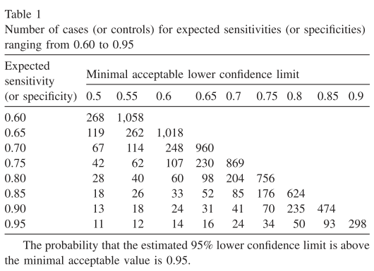

# Introduction 
Validation studies are used to evaluate machine learning models in an external, previously unseen data set to assess the 
diagnostic performance of the model. Most of the time, the validation sets are defined properly, e.g. by sampling data with enough 
variability in terms of known factors and by applying the appropriate metrics (tailored to the problem, including 95% CI) are applied and if applicable, assessed for statistical significance across different groups.


But one key question that needs to be answered is the following: **how precise are the sensitivity/specificity/... results that 
you are producing?** Said differently, how likely are these results to occur due to chance or are you truly measuring a 'real
effect', i.e., a result that would be achieved in the population? 
Answering this question brings us back to good-old statistics of power analysis and in this repository I have created Python code
for the sample size estimation of proportions (which can thus be applied to e.g. sensitivity and specifity) from the 
[paper](https://www.sciencedirect.com/science/article/pii/S0895435605000892) "Sample size calculation should be performed for design accuracy in diagnostic test studies 
by Flahault et al. in Clinical Epidemiology 2005.

# Sample size estimation for validation studies
Power analysis allows you to determine the required sample size to estimate a certain outcome with a given precision. 
It answers the question whether a given outcome measured in a sample of size N, is more likely to be a true effect 
that exists in the population or could have also been arrived at by chance. For instance, in clinical trials you are 
measuring outcome A in two groups (case vs. control) and the effect size is the difference in outcome A between 
both groups. If the effect size is expected to big (this is an input from the subject matter expert), you can 
imagine that not that much data (sample size N) are needed to confirm that both groups are different by this wide
margin. If on the other hand, the expected effect size is small (again, expert input), for a small N this difference 
between both groups could have also occurred by chance. Because for all (*TODO: add references*) distributions (of a given outcome), 
variance decreases with N, increasing the sample size will make sure that you can measure even a small difference in 
effect size between two groups. Of course, more data/bigger sample sizes imply that you need more time and money to build them, hence you'd want to 
compute the minimal sample size that would allow you to measure an outcome with a certain precision (e.g., being 
95% certain that the measured outcome is a true effect as that outcome would have been very unlikely to occur by chance).
 
In essence, this power analysis entails computing a (one-sided) hypothesis test to evaluate whether 95% (the **power** of the test) of the samples 
from the expected (binomial) distribution are within the 5% (alpha, the statistical significance level) quartile of the lower limit
(binomial) distribution. If this is the case, the null hypothesis (H_0: proportion=lower limit) can be rejected
and we accept the alternative hypothesis (i.e., the measured proportion is >lower limit with 95% probability).

In this repository, I have created some Python code for estimating the sample size using a command line interface (CLI). The user can input
the lower limit proportion, expected proportion, alpha (significance level for the hypothesis test), beta (1 - statistical power)
and the range of sample sizes to evaluate (defined using start, end and step).
One can reproduce table 1 from the Flahault et al. paper or compute their own sample size estimates given other input values (the paper only 
used alpha=beta=0.05 and the expected proportion ranging from 0.6 to 0.95 in steps of 0.05).



# How to use it?
1. Setup a python 3.x environment with scipy package installed
2. Clone this repository and run script from terminal
3. Run sample size estimation in two steps for the metric of interest (e.g., sensitivity)
   1. Define your (expert) inputs: lower limit and expected sensitivity (e.g., I expect a sensitivity of my model to be
   0.85=expected and want to make sure that my results will be >0.75=lower with 95% probability > beta=0.05). 
   2. Start with a coarse run using n_steps=10 (e.g. n_start=100, n_end=200).
   3. Then restart a fine run using n_step=1 and n_start/n_end based on the outputs from the previous run
   4. Use the first sample size that is printed (i.e., the first value that allows you to refute H_0)

Example usage:
- coarse run 1: n=180 seems appropriate
```
   $ python ~/estimatesamplesize.py -n_start 100 -n_end 200 -n_step 10 -lower 0.75 -expected 0.85
   180 145 0.04817221445699114
   190 153 0.04415864518741728
   Script completed successfully
   ```

- finer run 2: n=176 is formally the first value (see Table 1), but n=180 is a safer choice I'd say
```
   $ python ~/estimatesamplesize.py -n_start 170 -n_end 200 -n_step 1 -lower 0.75 -expected 0.85
   176 142 0.046214741027870314
   180 145 0.04817221445699114
   181 146 0.04425679492553406
   182 147 0.040616259299554515
   185 149 0.046118132970319484
   186 150 0.0423879228671131
   187 151 0.038918827471130735
   188 152 0.035696704098377746
   189 152 0.04797560668104062
   190 153 0.04415864518741728
   191 154 0.04060363203158888
   192 155 0.03729677726164169
   193 156 0.034224602507630146
   194 157 0.031373978817605765
   195 157 0.04228886689387957
   196 158 0.0388996898638283
   197 159 0.03574646819662394
   198 160 0.03281635183605827
   199 161 0.030096837588916167
   Script completed successfully

   ```
